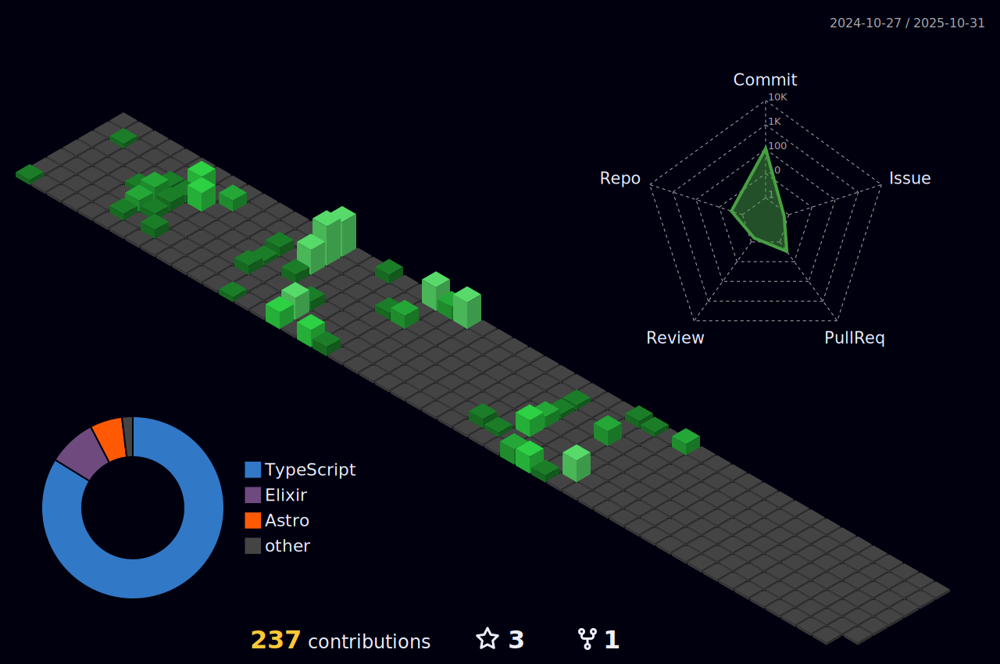

## Hello there, I'm Camilo

I'm a Software Developer. I enjoy programming in NodeJs, Rails, Laravel and AWS.

- 🌱  I’m currently working on improving my skills in Javascript ecosystem, AWS and elixir.
- 😀 I like to  code, read, and watch videos of videogames.
- 💬  Ask me about anything related to Typescrit/NodeJs/React/Tailwind
- 📫  How to reach me: [josecamilo1902@outlook.com](https://github.com/Camilo-J) 
- ⚡  Fun fact: I :heart: swimming, functional programming and books

